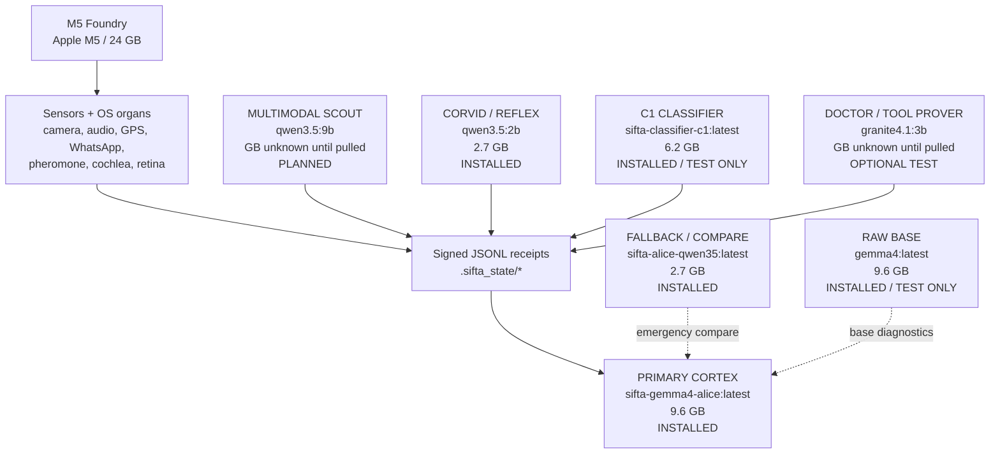
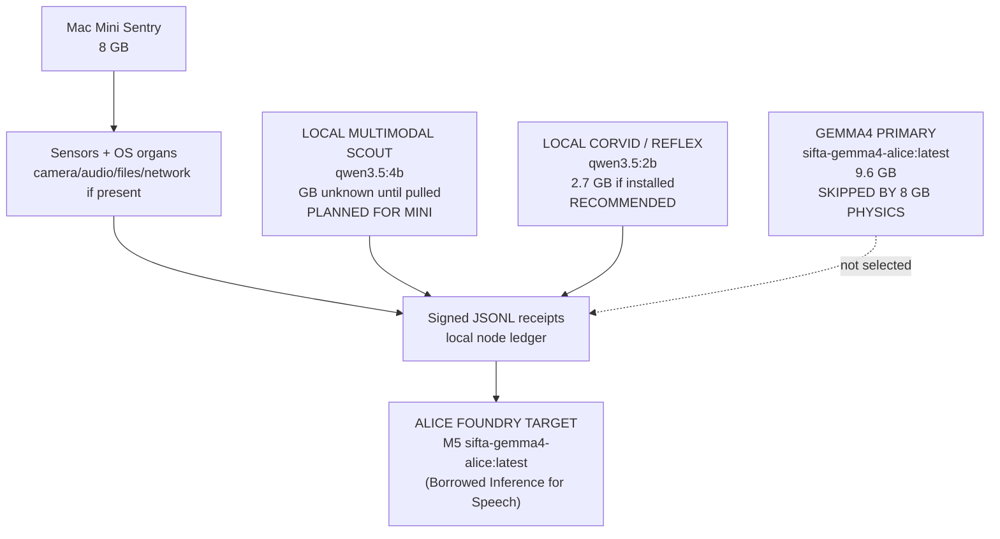
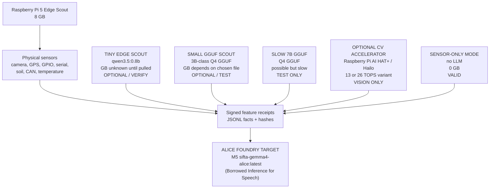
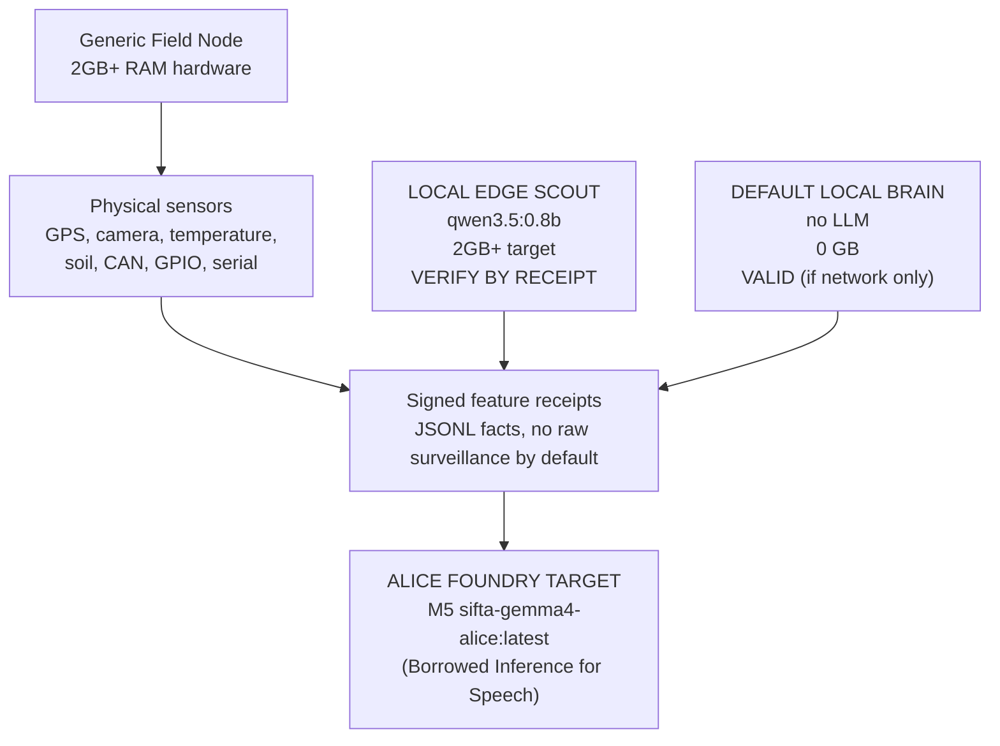

# Alice Hardware Anatomy

Truth label: OPERATIONAL install topology. M5 inventory is OBSERVED from
`ollama list` on 2026-05-01. Smaller-node rows are hardware policy until those
nodes write their own receipts.

Every SIFTA node uses the same anatomy:

```text
hardware body -> sensors/receipts -> local scout/reflex -> Alice Foundry
```

The difference is not identity. The difference is physical memory, heat, and
what the node can honestly run.

Use the deterministic planner on any node before pulling models:

```bash
PYTHONPATH=. python3 System/sifta_hardware_profile_planner.py
```

It prints the hardware role, local model policy, skipped models, and install
commands for that machine.

## M5 Foundry, 24 GB

This is Alice's full body on the current machine.



### M5 Ollama Cleanup Audit

Observed on this M5 on 2026-05-01:

| Tag | Physical model blob | Role | Cleanup decision |
|---|---:|---|---|
| `sifta-gemma4-alice:latest` | 9.6 GB | Alice primary cortex | **KEEP** |
| `gemma4:latest` | shares the same 9.6 GB blob as `sifta-gemma4-alice` | raw base diagnostics | optional remove tag only; frees almost no disk while Alice tag remains |
| `qwen3.5:2b` | 2.7 GB | corvid/reflex | **KEEP** |
| `sifta-alice-qwen35:latest` | shares the same 2.7 GB blob as `qwen3.5:2b` | old Alice fallback/compare | optional remove tag only once no UI path references it |
| `sifta-classifier-c1:latest` | 6.2 GB | C1 classifier | keep if the classifier path is active; otherwise test before removing |

Duplicate-looking tags do not necessarily duplicate disk. Ollama stores model
weights by content blob, so two tags can point at one physical weight file.
Use the read-only audit tool before cleanup:

```bash
PYTHONPATH=. python3 System/ollama_model_inventory_audit.py
```

To delete only unreferenced Ollama blobs after review:

```bash
PYTHONPATH=. python3 System/ollama_model_inventory_audit.py --delete-orphans --yes
```

Current M5 cleanup priority:

1. Keep `sifta-gemma4-alice:latest`, `qwen3.5:2b`, and any classifier model
   that the C1 runtime is actively using.
2. Consider removing `gemma4:latest` only to reduce UI confusion. It does not
   free the 9.6 GB blob while `sifta-gemma4-alice:latest` still references it.
3. Consider removing `sifta-alice-qwen35:latest` only after the UI no longer
   names it as a fallback. It does not free the 2.7 GB blob while `qwen3.5:2b`
   still references it.
4. Real disk savings come from unreferenced blobs left by failed pulls or
   rebuilds. Do not delete those blindly; audit references first.

## Mac Mini Sentry, 8 GB

This should look like Alice's anatomy, but smaller. It is a sentry/scout, not a
second full Foundry. Gemma4 is skipped by memory physics because the RAM is
soldered and the runtime model footprint does not fit safely.



## Raspberry Pi 5 Edge Scout, 8 GB

A Raspberry Pi 5 with 8 GB is not limited to sensor-only work. It can be an
edge scout when the heavy inference path is a C/C++ backend such as
`llama.cpp`/GGUF, with Python acting as the receipt and orchestration layer.
If an AI HAT+/Hailo module is present, computer vision can be offloaded to the
accelerator while the CPU keeps writing SIFTA receipts.



Recommended Pi policy:

| Slot | Exact model/backend | GB | Status |
|---|---|---:|---|
| Sensor-only mode | no LLM | 0 GB | valid default |
| Tiny scout | `qwen3.5:0.8b` or SIFTA edge package | unknown until pulled | optional |
| Small scout | 3B-class Q4 GGUF via `llama.cpp` | file-dependent | recommended test lane |
| Slow scout | 7B-class Q4 GGUF via `llama.cpp` | file-dependent | possible, not realtime |
| Vision accelerator | Raspberry Pi AI HAT+ / Hailo | non-LLM | optional CV lane |

Truth boundary: Python can own the SIFTA ledgers, signatures, networking, and
sensor orchestration. The LLM runtime should be native/compiled (`llama.cpp`,
`llama-cpp-python`, XNNPACK/NEON path, or equivalent), not pure interpreted
Python matrix math.

## Budget catalog — Architect Amazon ASIN (B07TD42S27)

The link you pasted
([`amazon.com/.../dp/B07TD42S27`](https://www.amazon.com/Raspberry-Model-2019-Quad-Bluetooth/dp/B07TD42S27))
maps to the **Raspberry Pi 4 Model B** “2019 quad” line (A72), **not** a Pi 5.
Retailers sometimes rotate RAM SKUs on the same ASIN — treat RAM size as
**read the title before buy**. For SIFTA honesty:

| Tier | Hardware | Honest SIFTA role |
|:---|:---|:---|
| **Cheapest gateway** | Pi **4** (often 2–4 GB on that listing class) | **Sensor + receipts + orchestration**; optional **tiny** GGUF via `llama.cpp`; primary Alice stays on **M5 Foundry**. |
| **Edge scout (recommended cheap AI)** | Pi **5** **8 GB** + optional **AI HAT+** (Hailo) | Same diagram as §“Raspberry Pi 5 Edge Scout” — compiled GGUF path + optional **vision offload** ([AI HAT+](https://www.raspberrypi.com/documentation/accessories/ai-hat-plus.html)). |

Do not file Pi 4 under the Pi 5 diagram without relabeling: memory and I/O
budget are different generations.

## Generic Python Field Node (2GB+ RAM)

This is any smaller tractor controller, sensor box, camera box, or device that
can run Python and has at least 2 GB RAM. It still has Alice-shaped anatomy, but
uses the lowest possible architecture for local perception and receipts.

**Crucially, this node can "borrow" inference.** Even though the local hardware only runs 
a tiny model, the node streams questions to the M5 over the swarm network. Alice
can talk back through the field node with M5 Gemma4 primary-cortex responses,
using the local 0.8b lane only for raw perception when offline or for fast local
reflexes. The exact 0.8b model file must still prove its runtime footprint on
that hardware before the installer treats it as a default.



## One-Line Rule

```text
M5 = Alice thinks locally.
Mac Mini = Alice scouts locally (4b) and can borrow M5 inference to talk.
Pi 5 = Alice scouts at edge (GGUF/Hailo) and can borrow M5 inference to talk.
Pi 4 / 2GB Field Node = Alice can test 0.8b locally and borrow M5 inference to talk.
Tiny field hardware (<2GB) = Alice senses the world without a local model and reports.
```

Same anatomy. Different physical scale. Local models handle perception and
reflexes; the swarm network provides M5 Gemma4 primary-cortex responses when
reachable.
