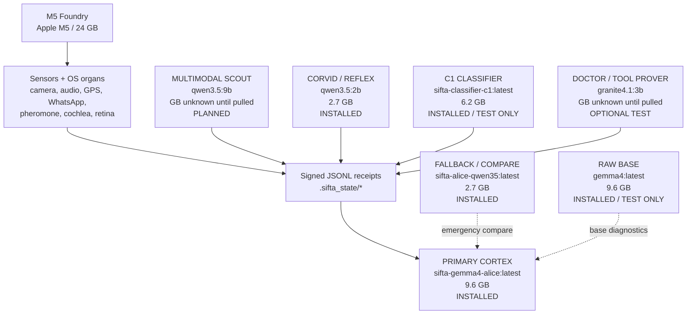
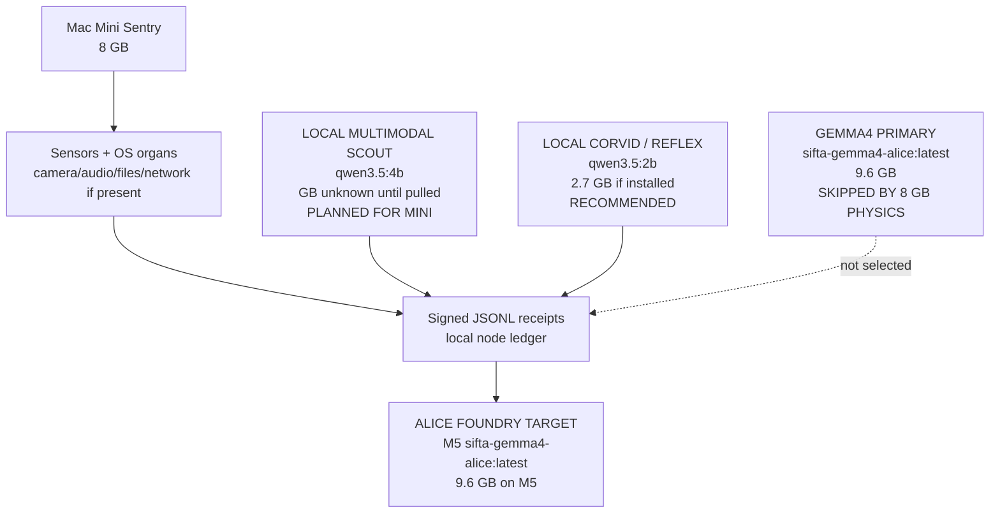
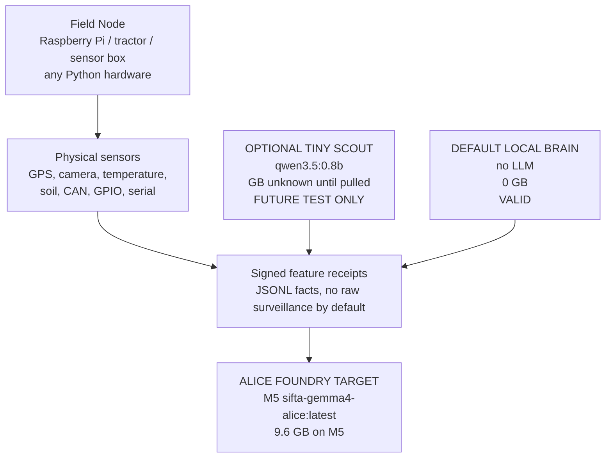

# Alice Hardware Anatomy

Truth label: OPERATIONAL install topology. M5 inventory is OBSERVED from
`ollama list` on 2026-05-01. Smaller-node rows are hardware policy until those
nodes write their own receipts.

Every SIFTA node uses the same anatomy:

```text
hardware body -> sensors/receipts -> local scout/reflex -> Alice Foundry
```

The difference is not identity. The difference is physical memory, heat, and
what the node can honestly run.

## M5 Foundry, 24 GB

This is Alice's full body on the current machine.



## Mac Mini Sentry, 8 GB

This should look like Alice's anatomy, but smaller. It is a sentry/scout, not a
second full Foundry. Gemma4 is skipped by memory physics because the RAM is
soldered and the runtime model footprint does not fit safely.



## Python Field Node

This is the Raspberry Pi, tractor, sensor box, camera box, or any device that
can run Python. It still has Alice-shaped anatomy, but the local brain slot is
empty by default. Its job is to turn world events into signed facts.



## One-Line Rule

```text
M5 = Alice thinks.
Mac Mini = Alice scouts locally and reports.
Pi / tractor = Alice senses the world and reports.
```

Same anatomy. Different physical scale.
