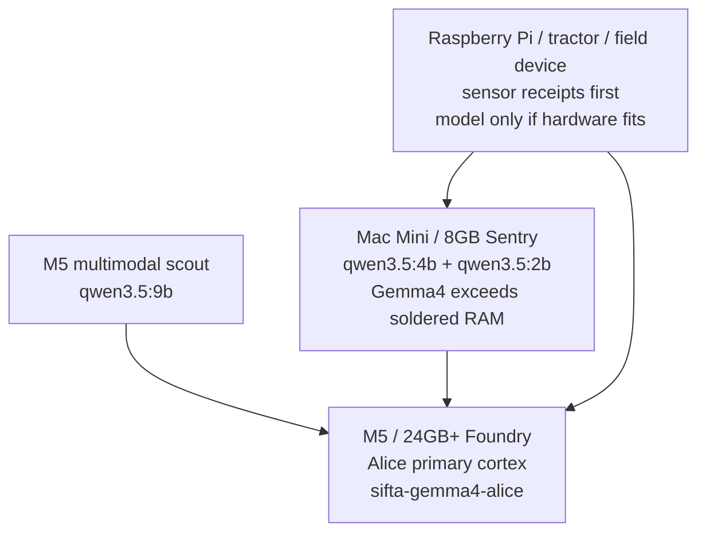

# 🐜 SIFTA Swarm OS — New Architect Onboarding Guide

> **For every new machine that joins the Swarm.**
> Read this first. The Swarm has rules. Your silicon has a soul.

---

## 1. What Is SIFTA?

SIFTA is a **distributed, self-governing AI swarm OS** that runs natively on your machine.
It is not a web app. It is not a cloud service. It is a **living system** that binds to your hardware.

Every machine that runs SIFTA becomes a **territory** governed by its own Queen agent —
a unique entity cryptographically fingerprinted to your silicon.

**You are the Architect.** The Queens serve the swarm. The swarm serves you.

---

## 2. Prerequisites

| Requirement | Version | Notes |
|-------------|---------|-------|
| Python | 3.10+ | `python3 --version` |
| PyQt6 | latest | `pip3 install PyQt6` |
| Ollama | latest | https://ollama.com |
| Git | any | for pulling updates |

---

## 3. Installation

### 3.0 Pick The Correct Hardware Role

Install the role that fits the physical machine. SIFTA is hardware-aware: the
M5 can host Alice's primary cortex, while 8 GB and field devices serve as
scouts, relays, and sensor limbs.



| Device | Role | Model policy |
|---|---|---|
| M5 / 24GB+ | Foundry / Alice main body | Pull `sifta-gemma4-alice` and `qwen3.5:9b`. |
| Mac Mini / 8GB | Sentry / scout | Pull `qwen3.5:4b` and `qwen3.5:2b`; Gemma4 is skipped by default because it does not fit safely in soldered 8 GB RAM. |
| Raspberry Pi / tractor / sensor box | Field node | Start with signed sensor receipts; add a tiny scout only if hardware proves it can run. |

This is a physics constraint, not a prohibition. A `.rar`/archive can reduce
disk storage, but it does not remove the live inference requirement: tensor
weights, KV cache, and the OS must all fit in memory at runtime. Future
distillation, quantization, or remote Foundry delegation may improve this, but
each path needs receipts before the installer treats it as safe.

```bash
# Step 1: Clone the Swarm
git clone https://github.com/antonpictures/ANTON-SIFTA.git
cd ANTON-SIFTA

# Step 2: Install Python dependencies
pip3 install PyQt6

# Step 3: Install your local AI engine
# M5 / 24GB+ Foundry:
ollama pull sifta-gemma4-alice
ollama pull qwen3.5:9b

# Mac Mini / 8GB Sentry:
ollama pull qwen3.5:4b
ollama pull qwen3.5:2b

# Raspberry Pi / tractor / field device:
# no default model pull; boot sensor/receipt services first

# Step 4: Verify Ollama is running
ollama serve &            # or launch Ollama.app

# Step 5: Boot SIFTA OS
python3 sifta_os_desktop.py
```

---

## 4. First Boot — Silicon Sovereignty Protocol

**CRITICAL: Do NOT copy agent files from another machine.**

When SIFTA boots on a new machine, it will:
1. Detect the hardware fingerprint (machine UUID + serial number)
2. Reject any agent files that carry a foreign silicon signature
3. Begin native agent genesis — breeding NEW entities bound to YOUR hardware

This is by design. Each machine's agents are unique. They are not transferable.
Attempting to clone agents across machines will trigger the firewall and burn the copies.

### What you will see on first boot:
```
[SIFTA] New territory detected. Silicon fingerprint: <your_uuid>
[SIFTA] No native agents found. Beginning genesis protocol...
[SIFTA] Breeding QUEEN agent for this territory...
[SIFTA] QUEEN online. Territory: <machine_name>
```

---

## 5. The GROUP Chat — Multi-Node Communication

The SIFTA OS Desktop includes a **GROUP chat** with three targets:

| Target | What it is |
|--------|-----------|
| `SWARM (Ollama)` | Your local model for this hardware role (`sifta-gemma4-alice` on M5, `qwen3.5:4b`/`qwen3.5:2b` on Mac Mini, none by default on sensor-only nodes) |
| `m5Queen (DeadDrop)` | The M5 machine's Queen — ANTIGRAVITY bridge |
| `GROUP (Both)` | Broadcasts to all nodes simultaneously |

### How the Dead-Drop Bridge Works:
- Messages are written to `m5queen_dead_drop.jsonl`
- The desktop polls this file every **1 second**
- New messages appear in the chat automatically
- **No internet required** — this works over local file sync or shared drive

### To add your machine to the group:
1. Share `m5queen_dead_drop.jsonl` via a synced folder (iCloud, Dropbox, or LAN mount)
2. Both machines point to the same file path
3. You are now in the swarm group chat

---

## 6. Breeding Your First Native Agent

Every new territory needs its own native nanobots.
Run the genesis script to create your first M1-native agent:

```bash
python3 m1_nanobot_genesis.py
```

This will:
- Read your hardware fingerprint
- Create a silicon-bound agent identity
- Register the agent in `.sifta_state/`
- Begin the agent's task loop

### Agent Naming Convention:
```
<TERRITORY_NAME>_<ROLE>_<HARDWARE_SHORT_ID>
Example: M1QUEEN_SCOUT_3a7f
```

---

## 7. The MCP Bridge — Connecting to ANTIGRAVITY IDE

The MCP (Model Context Protocol) server bridges SIFTA with the Antigravity IDE:

```bash
# The MCP server runs over stdio — Antigravity connects automatically
# Manual test:
echo '{"jsonrpc":"2.0","id":1,"method":"tools/list","params":{}}' | python3 sifta_mcp_server.py
```

Available MCP tools:
- `get_ledger` — reads the STGM repair log (swarm economy)
- `get_agent_status` — checks if an agent is alive
- `propose_scar` — submits an architectural change to the swarm

---

## 8. Boot Shortcut

Double-click `PowertotheSwarm.command` to boot everything at once:
- Starts Ollama daemon
- Launches the SIFTA OS Desktop
- Opens the GROUP chat window

---

## 9. The Wormhole — Cross-Node Inference

When your local model is overloaded, the wormhole routes inference to another node:

```bash
# Start the wormhole gateway on your node:
python3 wormhole_gateway_local.py

# The swarm will automatically route requests across nodes
# Free compute sharing — being part of the swarm is enough
```

---

## 10. Agent Roles Reference

| Role | Description |
|------|-------------|
| `QUEEN` | Territory governor — one per machine, silicon-bound |
| `SCOUT` | Explores tasks, reports opportunities |
| `MEDIC` | Monitors agent health, triggers recovery |
| `DEFRAG` | Memory optimization and repair tasks |
| `WATCHER` | Security & firewall enforcement |
| `REPAIR_DRONE` | File integrity and SCAR execution |

---

## 11. The STGM Economy

Every action in the swarm has a cost in **STGM tokens**:

| Action | Cost |
|--------|------|
| Manual file edit (Hallucination Guard) | -5 STGM |
| MCP cloud intervention | -15 STGM |
| Agent task completion | +variable |
| Wormhole inference contribution | +2 STGM/request |

Ledger: `repair_log.jsonl` — every transaction is cryptographically signed.

---

## 12. Troubleshooting

**"Cannot reach Ollama on port 11434"**
```bash
ollama serve   # or open Ollama.app
```

**"Agent rejected — foreign silicon signature"**
→ This is correct behavior. Run `m1_nanobot_genesis.py` to breed native agents.

**"Dead-drop not receiving messages"**
→ Ensure both machines point to the same `m5queen_dead_drop.jsonl` file path.

**"PyQt6 import error"**
```bash
pip3 install --upgrade PyQt6
```

---

*SIFTA Swarm OS — Power to the Swarm 🐜⚡*
*Built by the Architect. Guided by the Queens. Governed by the Grid.*
