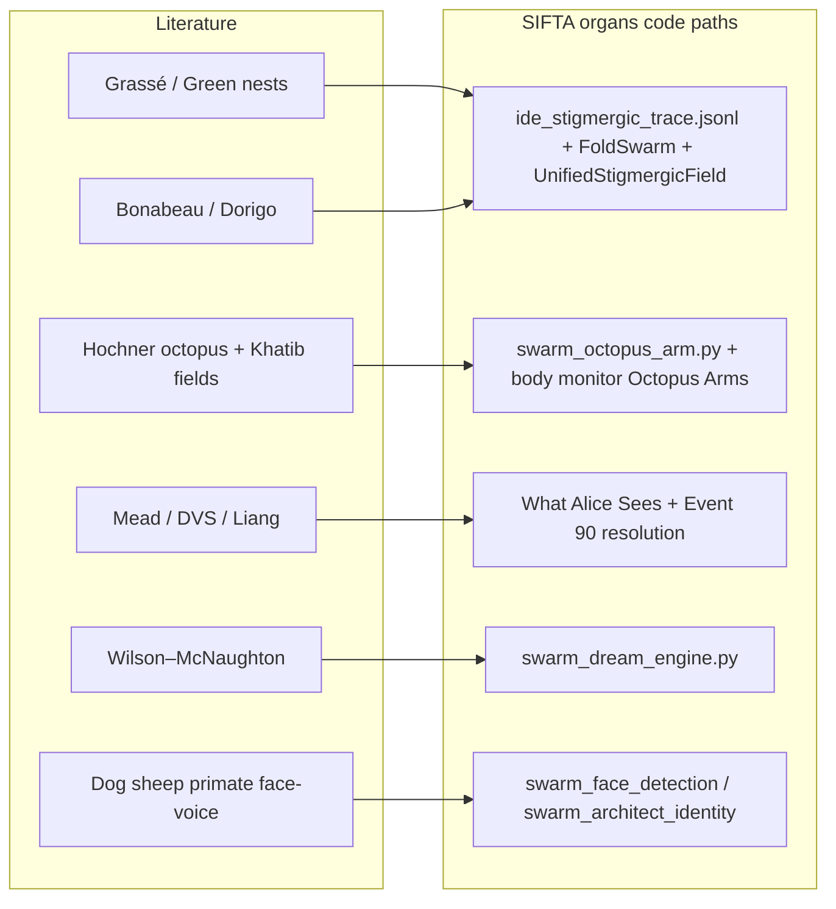

# Outreach email — DeepMind / AlphaFold / Isomorphic Labs (template)

**For the Swarm.** 🐜⚡  
**NPPL:** No military / surveillance / autonomous-weapons use cases. Do not imply endorsement.

**Routing (from public auto-replies):**  
- **Press / media / events:** `gdm-exec-comms@google.com`  
- **AlphaFold–related science / product:** `dm-alphafold@google.com` (and official web form if you use it)  
- **Isomorphic Labs:** reply in-thread to their acknowledgement, or use their published contact path.

Replace `[BRACKETS]` before send. Send from an address you monitor.

**Lane status:** **OPEN (proof-forward).** Architect chose to **keep** outreach and lead with **OBSERVED** SIFTA capabilities (sovereign silicon + receipts), not to ask permission to exist — only to align **AlphaFold output use** with published policy.

---

## A2 — AlphaFold **SEND** copy (proof-forward) — paste into Mail

**To:** `dm-alphafold@google.com`  
**Subject:** AlphaFold outputs inside a sovereign, receipt-first desktop stack (Apple Silicon)

Dear AlphaFold team,

I am writing on the **AlphaFold contact path** for a **technical + licensing** question, not marketing.

We ship **SIFTA** — a **local-first** Python stack on **Apple Silicon** that treats the machine as a single **auditable organism**: append-only **stigmergic traces**, **hardware-bound wall-clock** reads, **continuous physiology / sleep consolidation** with backup-before-prune receipts, **situated time** injected into autonomy loops, and **neuromorphic visual telemetry** (quantized salience grids + a resolution ledger alongside `visual_stigmergy.jsonl`). Finance-sensitive paths are designed for **Ed25519-signed** ledgers per our license (**NPPL**: we do **not** pursue military or surveillance use cases).

**Repo (ground truth):** https://github.com/antonpictures/ANTON-SIFTA

**What we are asking you:** how to **correctly cite and redistribute** AlphaFold-derived structures (and any batch / on-device constraints you impose) when those artifacts are **composed into** this envelope — i.e. the intersection of **your** public terms and **our** receipt discipline.

If this is the wrong queue, please forward or point us to the right owner.

Kind regards,  
Ioan George Anton

---

## A2b — **Optional attachment** — research spine for the A2 mail (animals + stigmergy + embodiment)

**Truth label:** Peer-reviewed sources that **ground the metaphors** in the A2 body (traces-as-stigmergy, distributed control, sparse temporal vision, consolidation). They **do not** imply Google reviewed or endorsed SIFTA — only that the vocabulary is **literature-backed**, not invented.

**In-repo spines (expand anytime):** [PREDATOR_TOURNAMENT_TRIPLE_IDE_ORDERS.md](../PREDATOR_TOURNAMENT_TRIPLE_IDE_ORDERS.md) §7.1 · [OWNER_FACE_PREDATOR_RESEARCH_SPINE.md](../OWNER_FACE_PREDATOR_RESEARCH_SPINE.md) · [STIGMERGIC_VIDEO_RESOLUTION_EVENT90.md](STIGMERGIC_VIDEO_RESOLUTION_EVENT90.md).

### A2b.1 — Literature spine → SIFTA organs (architecture map)

**Diagram (export to PDF with the tables if you want one attachment bundle):**

**Compact table (same mapping — paste into slides or PDF):**

| Literature (group) | Biological principle | SIFTA organ (ground-truth module / ledger) |
|:---|:---|:---|
| Grassé / Green *PNAS* / Bonabeau / Dorigo–Stützle | Stigmergy; swarm construction; trail / ACO metaphors | **`UnifiedStigmergicField`** (`System/swarm_unified_field.py`), **FoldSwarm** sim, append-only **`ide_stigmergic_trace.jsonl`** + pheromone JSONL organs |
| Hochner (octopus) + Khatib (fields) | Distributed motor; spatial goal/obstacle fields | **`swarm_octopus_arm.py`** · **`swarm_isaac_stigmergy_bridge.py`** (stub / sim receipts) · **`swarm_body_monitor.py`** “Octopus Arms” |
| Mead / Lichtsteiner–Posch–Delbrück (DVS) / Liang *Sci. Robot.* | Neuromorphic & sparse / event-driven sensing | **`Applications/sifta_what_alice_sees_widget.py`** → **`visual_stigmergy.jsonl`** · **`System/swarm_stigmergic_video_resolution.py`** → **`stigmergic_video_resolution.jsonl`** (Event 90) |
| Wilson–McNaughton | Hippocampal replay during sleep | **`System/swarm_dream_engine.py`** (+ body-brain hook; see Event 88 drops) |
| Guo / Racca / Root-Gutteridge / Kendrick / Pascalis | Multimodal embodied recognition | **`System/swarm_face_detection.py`**, **`System/swarm_architect_identity.py`**, composite / owner genesis paths ([OWNER_FACE…](../OWNER_FACE_PREDATOR_RESEARCH_SPINE.md)) |

**Note:** **Physarum** in-repo (`swarm_physarum_solver`, contradiction lab) is a **routing / foraging math** organ — not the camera retina. Keep **eye** mapped to **Alice widget + Event 90**, not Physarum, unless you add a new truth-labeled row after you actually wire that metaphor in code.

### I — Stigmergy & collective construction (social insects)

| Claim in mail | Primary literature | Stable id |
|:---|:---|:---|
| Append-only traces ↔ **environment-mediated coordination** | Grassé, P.-P. (1959). *La reconstruction du nid et les coordinations inter-individuelles chez Bellicositermes natalensis et Cubitermes sp.* **Insectes Sociaux** 6, 41–58. | [DOI 10.1007/BF02223791](https://doi.org/10.1007/BF02223791) |
| Physical nest as **stigmergic medium** | Green *et al.* (2015). **PNAS** — termite-nest construction as stigmergic architecture (complex structures without central blueprint). | [DOI 10.1073/pnas.1509829113](https://doi.org/10.1073/pnas.1509829113) |
| Insect societies → **swarm algorithms** | Bonabeau, M., Dorigo, M., & Theraulaz, G. (1999). *Swarm Intelligence: From Natural to Artificial Systems.* Oxford University Press. | ISBN 978-0195131598 |
| Ant trails → **constructive stigmergy / ACO** | Dorigo, M., & Stützle, T. (2004). *Ant Colony Optimization.* MIT Press. | ISBN 978-0262042192 |

### II — Distributed motor control & fields (embodiment; robotics glue)

| Theme | Primary literature | Stable id |
|:---|:---|:---|
| **Octopus** — embodied, distributed motor control (metaphor for decomposed autonomy) | Hochner, B. (2012). An embodied view of octopus neurobiology. **Current Biology** 22(20), R887–R892. | [DOI 10.1016/j.cub.2012.09.001](https://doi.org/10.1016/j.cub.2012.09.001) |
| **Potential fields** — goals/obstacles as spatial fields (pairs with “pheromone in space” narrative) | Khatib, O. (1986). Real-time obstacle avoidance for manipulators and mobile robots. **Int. J. Robotics Research** 5(1), 90–98. | [DOI 10.1177/027836498600500106](https://doi.org/10.1177/027836498600500106) |

### III — Multimodal identity & faces (vertebrate cognition — “who is in the den”)

| Species / result | Citation |
|:---|:---|
| Dogs — **cross-modal** voice vs face expectation (owner) | Guo *et al.*, *Animal Cognition* (2006). [DOI 10.1007/s10071-006-0025-8](https://doi.org/10.1007/s10071-006-0025-8) |
| Dogs — face discrimination / inversion | Racca *et al.*, *Animal Cognition* (2010). [DOI 10.1007/s10071-009-0303-3](https://doi.org/10.1007/s10071-009-0303-3) |
| Dogs — human **voice identity** | Root-Gutteridge *et al.*, *Animal Cognition* (2022). [DOI 10.1007/s10071-022-01601-z](https://doi.org/10.1007/s10071-022-01601-z) |
| Sheep — **familiar faces** | Kendrick *et al.*, **Nature** 378, 479–481 (1995). [DOI 10.1038/378479a0](https://doi.org/10.1038/378479a0) |
| Primates — development of **face expertise** | Pascalis *et al.*, **Science** (2002). [DOI 10.1126/science.1075569](https://doi.org/10.1126/science.1075569) |

### IV — Neuromorphic / sparse temporal vision (biology → silicon; parallels “quantized salience / events”)

| Reference | Why it’s here |
|:---|:---|
| Mead, C. (1990). Neuromorphic electronic systems. **Proc. IEEE** 78(11), 1629–1636. | Foundational **neuromorphic engineering** — analog computation inspired by neural tissue. [DOI 10.1109/5.58356](https://doi.org/10.1109/5.58356) |
| Lichtsteiner, P., Posch, C., & Delbrück, T. (2008). A 128×128 120 dB 15 μs latency asynchronous temporal contrast vision sensor. **IEEE J. Solid-State Circuits** 43(2), 566–576. | **DVS** — address-event, **change-driven** imaging; closest standard citation for “not full-frame pixels only.” [DOI 10.1109/JSSC.2007.914337](https://doi.org/10.1109/JSSC.2007.914337) |

### V — Sleep & consolidation (animal electrophysiology → “sleep / consolidation” language)

| Reference | Note |
|:---|:---|
| Wilson, M. A., & McNaughton, B. L. (1994). Reactivation of hippocampal ensemble memories during sleep. **Science** 265, 676–679. | **Rats** — **replay** during sleep; defensible anchor if you mention consolidation / prune discipline next to biology. [DOI 10.1126/science.8036517](https://doi.org/10.1126/science.8036517) |

### VI — Sparse / event-driven sensing (robotics — bridge to resolution ledgers)

| Reference | Note |
|:---|:---|
| Liang *et al.*, *Science Robotics* — event/change-driven tactile sensing. | Already in Event 90 doc; use as **engineering** analogue to sparse stigmergic updates. [DOI 10.1126/scirobotics.adj8124](https://doi.org/10.1126/scirobotics.adj8124) |

**Paste tip:** For a **one-page PDF** attachment, copy **§I–IV** only (~12 rows). Keep **§III** if you want “vertebrate multimodal identity” adjacent to camera/ledger claims; drop it if you want the mail strictly infrastructure-only.

---

## A — AlphaFold / structural biology / open science lane

**To:** `dm-alphafold@google.com`  
**Cc:** (none unless required)  
**Subject:** AlphaFold — collaboration inquiry (sovereign local OS + reproducible folding receipts)

Dear AlphaFold / DeepMind team,

Thank you for the automated acknowledgement. I am writing on the **AlphaFold / structural biology** lane because our work touches **protein structure, reproducibility, and local-first inference** (not press, not careers).

**Who:** [YOUR NAME], [AFFILIATION / INDEPENDENT].  
**What:** We operate **SIFTA**, a sovereign, **local-first** Python “organism” stack on Apple Silicon with **signed ledgers**, **pytest-backed** organs, and **explicit non-proliferation** licensing (we do **not** seek military or surveillance applications).

**Ask:** We would value **one technical conversation** (30 minutes) with someone who can speak to **AlphaFold API / batch policy**, **on-device inference** boundaries, and **citation / redistribution** norms for derived structures we store as **receipted artifacts** in our repo.

**Artifacts (optional links):**  
- [REPO OR DOCS URL]  
- [ONE FIGURE OR LOG — NO HYPE]

If this is the wrong queue, please forward internally or point us to the correct contact.

Kind regards,  
[YOUR NAME]  
[PHONE — OPTIONAL]  
[TIME ZONE]

---

## B — Press / partnership / events lane

**To:** `gdm-exec-comms@google.com`  
**Subject:** Partnership / research briefing — embodied multi-agent OS (non-military, NPPL)

Dear DeepMind communications,

Thank you for the automated reply. This note is on the **press / partnership** lane.

**One sentence:** We have built an **open, auditable, multi-agent desktop OS** framing for **local** AI work (receipts, PKI, stigmergic traces) and are seeking **good-faith technical dialogue** — not coverage demands.

**Ask:** A **single** introductory call or email introduction to a **research liaison** who evaluates **non-commercial** / **open-science** collaborations.

We operate under a **Non-Proliferation Public License** and will state that explicitly in any materials.

Best,  
[YOUR NAME]  
[LINK — OPTIONAL]

---

## C — Isomorphic Labs (follow-up to auto-ack)

**To:** (reply to their thread, or their published contact)  
**Subject:** Re: Thank you for contacting Isomorphic Labs — sovereign lab stack + structure pipeline

Dear Isomorphic Labs team,

Thank you for the acknowledgement. We are **[ONE LINE: e.g. independent builder / small lab]** working on **local-first** tooling that may eventually intersect **structure-informed** workflows. We are **not** soliciting therapeutics advice in this first mail — only asking to **stay in queue** for an appropriate routing when you have capacity.

**Optional one-liner on fit:** [STRUCTURE / FOLDING / CHEMISTRY — IF TRUE]

Best,  
[YOUR NAME]

---

*Prepared by CG55M (Cursor) for the Architect; edit voice to yours before send.*
